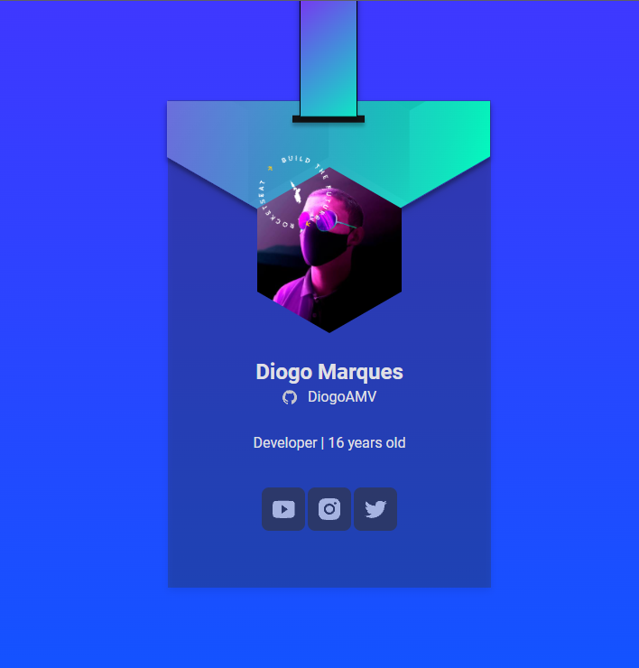

# Cracha NLW



> Cracha exclusivo para uso na DoWhile 2021, criado na NLW Heat da RocketSeat. O cracha contém informmações sobre a pessoa na qual está utilizando.

## 💻 Pré-requisitos

Antes de começar, verifique se você atendeu aos seguintes requisitos:
* Você tem uma máquina `<Windows / Linux / Mac>`.

## ☕ Usando o Cracha NLW

Para usar o Cracha NLW, siga estas etapas:

```
Baixe o projeto e descompacte ele
Abra a pasta do projeto em seu editor de códigos
Pronto! :)
```

## 📫 Contribuindo para o Cracha NLW
Para contribuir com o Cracha NLW, siga estas etapas:

1. Bifurque este repositório.
2. Crie um branch: `git checkout -b <nome_branch>`.
3. Faça suas alterações e confirme-as: `git commit -m '<mensagem_commit>'`
4. Envie para o branch original: `git push origin <nome_do_projeto> / <local>`
5. Crie a solicitação de pull.

Como alternativa, consulte a documentação do GitHub em [como criar uma solicitação pull](https://help.github.com/en/github/collaborating-with-issues-and-pull-requests/creating-a-pull-request).

## 📝 Licença

Esse projeto está sob licença. Veja o arquivo [LICENÇA](LICENSE.md) para mais detalhes.
